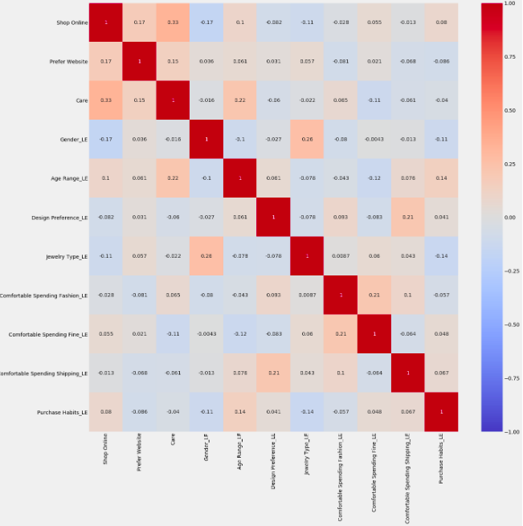
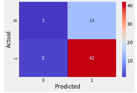

# Earnament Analysis

## Dataset 
Collected 236 earring market survey for small online business. Summary of survey questions:
1. Gender	
2. Age Range	
3. Frequency of wearing jewely
4. Jewelry type
5. Design preferences
6. Amount spent on Fashion / Fine jewelry
7. Amount spent on shipping
8. Purchase Habits
9. Online shopping preferences 
10. Website preferences
11. Care level for jewelries

## Goal
Based on participants' responses to the above 10 survey questions, I would like to pick the best features in order to predict two different variables:
- Comfortable Spending Shipping -- how much shipping fees will a person be comfortable spending
- Purchasing habit -- if a person will buy jewelry planned or unplanned (impulsively)
I took two approaches: logistic regression and a random tree regression. 

## Data Cleaning
Shortened table values and column names, got rid of unneccesary and messy information.
Checked for and got rid of for null values

## EDA & Data Visualization

## Feature Selection
In order to determine the best feature for regression analysis and classification modeling, I used three different techniques: 
1. Univariate Selection
2. Feature Importance
3. Correlation Matrix with Heatmap

Here is a heatmap using technique #3:

## Logistic Regression
I used logistic regression to predict how much shipping fees will a person be comfortable spending. I used three features and scored an accuracy of 67%

## Random Forest Regression
I used random forest regression to predict a person's purchasing habit through five selected features: Age Range, Jewelry Type, Gender, Online Shopping Preferences, Website Preferences. Before doing so, I label encoded the dataframe. 

Results:

## Hypothesis Testing & Bootstrapping
I ran a hypothesis test on Age Range and Website Preference. I generated a 95% Confidence Interval on the correlation between both factors, and concluded that there is no association. The residual plot also prove zero correlation.
